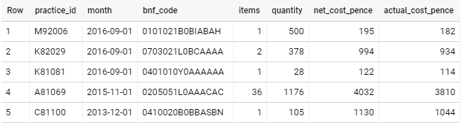

# openprescribing-public-database

# Prescribing queries

Documentation about common queries against the prescribing dataset. This document will show you how to query the raw prescribing data in order to get the information that you want.

## Set up a BigQuery Account 


You will need a Google account with the correct permissions (set up by an administrator) to access our BigQuery account. 

This will give you access to https://console.cloud.google.com/bigquery?project=ebmdatalab&p=ebmdatalab&d=public_draft&page=dataset. You should see Query Editor. 

## Familiarise yourself with the basics

Google have a quick start guide that uses publicly available data with SQL. Please follow [this quickstart](https://cloud.google.com/bigquery/quickstart-web-ui) (ignoring the first section "Before you begin")

## Brief introduction to queries in the prescribing data

SQL is structured query language and is used to interactive with data. SQL Databases consists of a number of tables that can be linked together.

This table contains prescribing data. Each practice is denoted by a practice id ('practice_id') and each drug formulation by a bnf code ('bnf_code'). 



For example say we want to extract number of co-amoxiclav prescriptions (BNF code '0501013K0') for one GP practice for 1 month, you can write a simple SQL query. In this scenario we will use practice id F84062 and month of July 2019. 

```sql
SELECT *
FROM ebmdatalab.public_draft.prescribing
WHERE bnf_code = '0501013K0'
AND month = '2019-07-01'
AND practice_id = 'F84062'
```

If you run this query, you will get a table with 4 rows totalling 16 prescriptions. You can export this as a CSV file. 

<details>
  
<summary>How does this query work? </summary>

<br>
Let's explore what we did:
<br>

```sql
SELECT *   <--- this selects all answers 

FROM ebmdatalab.public_draft.prescribing <--- this tells the query which tables to look at. In this case the prescribing table. 

WHERE bnf_code = '0501013K0%' <---- this chooses a BNF code that starts with the code for co-amoxiclav. See below for more info. 

AND month = '2019-07-01' <---- this chooses the month. You have to select the first day of the month to get results as prescribing data is released monthly

AND practice_id = 'F84062' <---- this chooses the pratice. It needs to exactly fit the practice id

```
</detail>


